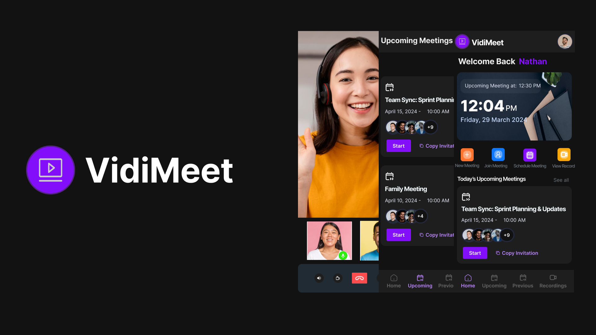

<div align="center">
  <br />
  
  <br />
  <div>
    
    
    
    
  </div>

# VIDI MEET
</div>

A video chat application built with Expo, React Native, and GetStream SDK, providing similar functionalities to Zoom.

---

## 📂 Folder Structure
- **App**: Contains the application’s source code.
- **API**: Contains the source code for serverless Vercel API functions.

---

## ⚙️ Installation

1. **Clone the Repository**
   ```bash
   git clone https://github.com/nathan-somto/vidi-meet.git
   cd vidi-meet
   ```

2. **Install Dependencies**
   ```bash
   npm install
   # or
   yarn install
   ```

3. **Set Up Environment Variables**
   - Create a `.env` file in the root directory with your keys:
    ```bash
    CLERK_PUBLISHABLE_KEY=''
    CLERK_SECRET_KEY=''
    STREAM_API_KEY=''
    STREAM_API_SECRET=''
    ```

4. **Run the App**
   ```bash
   npx expo start
   ```

---

## 🛠 Tech Stack

- **Clerk**: Authentication service.
- **GetStream**: Real-time social and chat features.
- **React Native**: Core framework.
- **Expo**: Universal React platform.
- **TypeScript**: For a  type-safe codebase.
- **React Navigation**: For screen-to-screen navigation.
- **Zustand**: State management library.

---

## 📍 Route Management
All route names are stored in an enum for consistent navigation. This enum can be found in `routes.ts`:

```typescript
 export enum Routes {
  // SCREENS
  PROFILE = 'Profile',
  WELCOME = 'Welcome',
  HOME = 'Home',
  UPCOMINGMEETINGS = 'Upcoming Meetings',
  PREVIOUSMEETINGS = 'Previous Meetings',
  MEETINGRECORDINGS = 'Meeting Recordings',
  SCHEDULEMEETING = 'Schedule Meeting',
  JOINMEETING = 'Join Meeting',
  NEWMEETING = 'New Meeting',
  VIDEOPLAYER = 'Video',
  CALL = 'Call',
  CALLSETUP = 'Call Setup',
  CALLENDED = 'Call Ended',
  AUTH = 'Auth',
  VERIFY = 'Verify',
  USERLIST = 'Users',
  // NAVIGATION
  AUTHSTACK = 'AuthStack',
  AUTHENTICATEDSTACK = 'AuthenticatedStack',
  CALLSTACK = 'CallStack',
  MAINTABS = 'MainTabs',
  MEETINGSTACK = 'MeetingStack',
}
```


--- 


